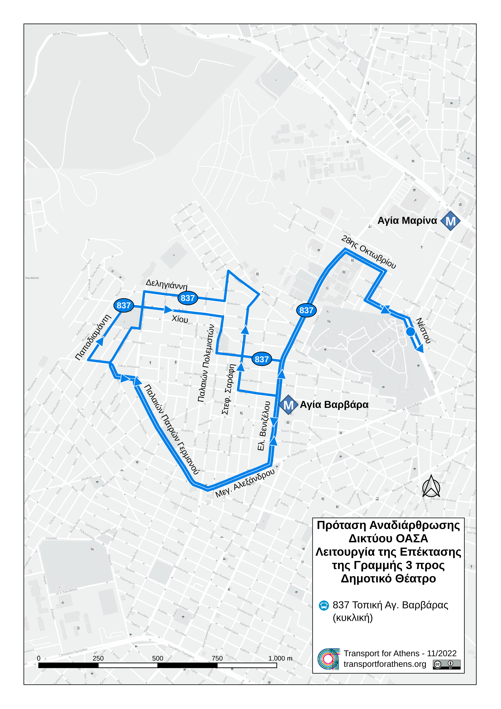

# Πρόταση αναδιάρθρωσης δικτύου ΟΑΣΑ με την επέκταση της γραμμής 3 του μετρό στον Πειραιά: Αγία Βαρβάρα, Κορυδαλλός, Νίκαια, Κερατσίνι, Δραπετσώνα

*Δημήτρης Νιώρας, Νοέμβριος 2022*

Η ολοκλήρωση της επέκτασης της γραμμής 3 του μετρό προς το κέντρο του Πειραιά αποτελεί μια τεράστια ευκαιρία για την αναδιάρθρωση του περίπλοκου δικτύου των δυτικών προαστίων στις περιοχές τις οποίες εξυπηρετούν οι σταθμοί της νέας αυτής επέκτασης. Το δίκτυο της περιοχής αποτελείται από ένα περίπλοκο σύνολο γραμμών με αρκετές παραλλαγές οι οποίες εξυπηρετούν τις ίδιες γειτονιές με διαφορετικό τρόπο και τις συνδέουν με τα κέντρα της Αθήνας και του Πειραιά. Η έλλειψη στοιχειωδών αρχών συγκοινωνιακού σχεδιασμού και οράματος για την περιοχή έχει οδηγήσει στην περαιτέρω "περιπλοκοποίηση" του δικτύου, η οποία, σε συνδυασμό με τη μείωση των δρομολογίων που έχει παρατηρηθεί τις δύο τελευταίες δεκαετίες, έχει δημιουργήσει ένα σύνολο πολλών αραιών γραμμών ελάχιστα ανταγωνιστικών προς το αυτοκίνητο, αφού στην προσπάθειά τους να καλύψουν όσο το δυνατόν περισσότερες μετακινήσεις καταλήγουν να τις εξυπηρετούν με πολύ χαμηλή ποιότητα. Τέλος, η τάση μετατροπής όσο περισσότερων γραμμών σε τροφοδοτικές προς τους σταθμούς μετρό χωρίς να λαμβάνονται υπόψη οι συγκοινωνιακές ανάγκες, η αύξηση των μετεπιβιβάσεων σε ένα δίκτυο με αραιές μέσες συχνότητες, καθώς επίσης και η ίδια η χωρητικότητα του μετρό, έχουν οδηγήσει σε συνολική υποβάθμιση της εξυπηρέτησης η οποία αναιρεί ένα μεγάλο μέρος της ωφέλειας από την έλευση του μετρό στις περιοχές αυτές.

Η μελέτη αυτή προτείνει τον εκτενή επανασχεδιασμό του δικτύου στις περιοχές Αγίας Βαρβάρας, Κορυδαλλού, Νίκαιας, Δραπετσώνας και Πειραιά, λαμβάνοντας υπόψη τις εξής αρχές:

* Απλό και εύκολα κατανοητό δίκτυο

* Λίγες γραμμές με πολύ καλές συχνότητες αντί πολλών γραμμών με χαμηλότερες συχνότητες

* Γραμμές που κατά κύριο λόγο ακολουθούν τη νοητή συντομότερη διαδρομή αντί να παρακάμπτονται συνεχώς

* Διατήρηση ενός βασικού κορμού λεωφορειακών γραμμών για την απευθείας σύνδεση των κέντρων των γειτονιών με το κέντρο του Πειραιά

* Οι γραμμές του βασικού κορμού σύνδεσης με τον Πειραιά ακολουθούν βασικούς οδικούς άξονες αντί να εισέρχονται μέσα στις γειτονιές

* Οι γραμμές που εισέρχονται μέσα στις γειτονιές εστιάζουν στις τοπικές μετακινήσεις και τροφοδοτούν το μετρό και το δίκτυο γραμμών κορμού

* Οι γραμμές, κατά το μέγιστο δυνατό, ακολουθούν την ίδια διαδρομή και στις δύο κατευθύνσεις, με εξαίρεση τα ζεύγη κυκλικών αντίρροπων γραμμών

* Οι κυκλικές αντίρροπες γραμμές πρέπει να χρησιμοποιούνται με μέτρο, να έχουν την ίδια συχνότητα και να εξυπηρετούν συγκεκριμένους και κοινούς στόχους που δεν είναι εφικτό να εξυπηρετηθούν με διαφορετικό τρόπο (έλλειψη χώρου ή οδικό δίκτυο που δεν επιτρέπει την επιστροφή μέσω των ίδιων οδικών αξόνων, εξυπηρέτηση συνδυασμού μετακινήσεων που σε άλλη περίπτωση θα οδηγούσαν σε μεγάλο αριθμό μετεπιβιβάσεων)

## Βασικός κορμός συνδέσεων με το κέντρο Πειραιά

Για την απευθείας σύνδεση της περιοχής μελέτης με το κέντρο του Πειραιά προτείνεται να παραμείνουν με κάποιες τροποποιήσεις οι εξής γραμμές:

* 800 Πειραιάς - Νίκαια - Σχιστό (τροποποιείται)

* 830 Πειραιάς - Κορυδαλλός - Αγία Βαρβάρα (τροποποιείται)

* 831 Πειραιάς - Καμίνια - Αιγάλεω (τροποποιείται)

* 828 Πειραιάς - Καμίνια - Άσπρα Χώματα

Οι γραμμές 800 και 830 αποτελούν το βασικό ζεύγος γραμμών για την εξυπηρέτηση της Νίκαιας, του Κορυδαλλού και της Αγίας Βαρβάρας με τον πιο άμεσο τρόπο. Και οι δύο γραμμές αποκτούν κοινή αφετηρία στην Ακτή Ξαβερίου, κοινή διαδρομή εντός του Πειραιά και κοινή δρομολόγηση.

Οι γραμμές 831 και 828 αποτελούν έναν δευτερεύοντα συνδετήριο άξονα των δυτικών προαστίων με τον Πειραιά και εξυπηρετούν μετακινήσεις όπως από και προς το Γενικό Νοσοκομείο Νίκαιας. Ταυτόχρονα, οι δύο αυτές γραμμές τροποποιούνται ώστε να εξυπηρετούν το κέντρο της περιοχής των Καμινίων (οδός Δωδεκανήσου) και να το συνδέσουν με το κέντρο του Πειραιά μέσω της οδού Γρ. Λαμπράκη, δημιουργώντας έτσι μία σύνδεση η οποία δεν είναι εφικτή με το υφιστάμενο δίκτυο. Και οι δύο γραμμές αποκτούν κοινή αφετηρία στην Πλατεία Καραϊσκάκη, κοινή διαδρομή εντός του Πειραιά και κοινή δρομολόγηση.

### Γραμμή 800 Πειραιάς - Νίκαια - Σχιστό

Η γραμμή 800 τροποποιείται ώστε να συνδέει τη Νίκαια και το Σχιστό Κορυδαλλού με τον Πειραιά. Αντικαθιστά τη γραμμή 814 στο κομμάτι Σχιστού-Καραβά και παύει να διέρχεται από τη Νεάπολη και το τμήμα Μαραθωνομάχων-Αισώπου (θα εξυπηρετείται από τροποποίηση της γραμμής 852). Η περιοχή της Άνω Νεάπολης εξυπηρετείται απευθείας προς Πειραιά με τις υφιστάμενες γραμμές 824-825, ενώ πολλά τμήματα των υφιστάμενων γραμμών κατά μήκος της νέας γραμμής απλοποιούνται.

### Γραμμή 830 - Πειραιάς - Κορυδαλλός - Αγία Βαρβάρα

Η γραμμή 830 τροποποιείται ώστε να καλύπτει τη συντομότερη διαδρομή μεταξύ Πειραιά, Κορυδαλλού και Αγ. Βαρβάρας και να εξυπηρετεί τοπικές μετακινήσεις. Σταματά να διέρχεται από την Άνω Αγ. Βαρβάρα, ενώ εξυπηρετεί και το Πανεπιστήμιο Δυτικής Αττικής (ΠΑΔΑ) αντικαθιστώντας τη γραμμή 831 στο τμήμα Στ. Αγ. Μαρίνα – ΠΑΔΑ, συνδέοντάς το με τον κοντινότερο σταθμό μετρό και δίνοντας τη δυνατότητα σε ένα μεγάλο αριθμό φοιτητών στις περιοχές Νίκαιας και Κορυδαλλού απευθείας σύνδεση.

### Γραμμή 831 Πειραιάς - Καμίνια - Αιγάλεω

Η γραμμή 831 τροποποιείται ώστε να αποκτήσει απλούστερη διαδρομή, να εξυπηρετήσει τους ίδιους οδικούς άξονες και στις δύο κατευθύνσεις και να εξυπηρετήσει τα Καμίνια και την οδό Γρ. Λαμπράκη, διερχόμενη από Καμίνια και στην κατεύθυνση προς Πειραιά. Ακόμη, όπως και με τη γραμμή 830, τροποποιείται ώστε να εξυπηρετήσει το τμήμα της γραμμής 830 στην Αγία Βαρβάρα και να συνδέσει την οδό Μεγάλου Αλεξάνδρου με τον σταθμό Αγίας Μαρίνας και όλες τις δυνατές συνδέσεις προς Χαϊδάρι.

### Γραμμή 828 Πειραιάς - Καμίνια - Άσπρα Χώματα

Η γραμμή 828 τροποποιείται επίσης ώστε να αποκτήσει απλούστερη διαδρομή, να εξυπηρετήσει τα Καμίνια και στις δύο κατευθύνσεις, καθώς και να εξυπηρετήσει το κέντρο του Πειραιά. Ο αποκλειστικός ρόλος της γραμμής αυτής είναι να λειτουργεί συμπληρωματικά ως προς τη γραμμή 831 παρέχοντας καλύτερη συχνότητα εξυπηρέτησης στο κοινό τους τμήμα, αλλά μπορεί να καταργηθεί αν οι ανάγκες χωρητικότητας στο αποκλειστικό τμήμα της 831 είναι παρόμοιες με αυτές στο κοινό τμήμα των γραμμών 828 και 831. Τέλος, το τμήμα της οδού Ν. Μπελογιάννη θα εξυπηρετείται από την υπάρχουσα γραμμή 909.

## Τοπικό - τροφοδοτικό δίκτυο Αγίας Βαρβάρας

Η υφιστάμενη διαδρομή της γραμμής 837 είναι αρκετά περίπλοκη και δημιουργεί σύγχυση προς το επιβατικό κοινό. Με την τροποποίηση της γραμμής 830, η οποία πλέον δε διέρχεται από την Άνω Αγ. Βαρβάρα, δίνεται η δυνατότητα στη γραμμή 837 να εστιάσει στις τοπικές μετακινήσεις και να συνδέσει την Άνω Αγ. Βαρβάρα με τον σταθμό μετρό Αγ. Βαρβάρας πιο αποτελεσματικά και γρήγορα.

### Γραμμή 837 Τοπική Αγίας Βαρβάρας (κυκλική)

Η γραμμή 837 τροποποιείται ώστε να απλοποιηθεί και να εξυπηρετήσει τμήμα της γραμμής 830, η οποία δεν εξυπηρετεί πλέον την περιοχή της Άνω Αγ. Βαρβάρας. Περιορίζεται σε τοπική-τροφοδοτική του Στ. Αγ. Βαρβάρας με πολύ καλές συχνότητες. Παρέχει γρήγορη σύνδεση με το Γενικό Νοσοκομείο Αγ. Βαρβάρας και πραγματοποιεί κύκλο εντός της Άνω Αγ. Βαρβάρας με σημείο επιστροφής τον σταθμό μετρό Αγ. Βαρβάρας.

## Τοπικό - τροφοδοτικό δίκτυο Κορυδαλλού

Ο Κορυδαλλός μέχρι στιγμής εξυπηρετείται από τις προτεινόμενες γραμμές κορμού 800 και 830 προς το μετρό και τον Πειραιά. Η γραμμή 800 εξυπηρετεί το Σχιστό και τον Καραβά και προσφέρει γρήγορες μετακινήσεις προς τον σταθμό μετρό της Νίκαιας, ενώ η γραμμή 830 διέρχεται από το κέντρο του Κορυδαλλού (Πλ. Ελευθερίας, οδός Αθηνάς). Πάνω σε αυτό το βασικό δίκτυο προτείνεται η διατήρηση της γραμμής 807 για τη σύνδεση του Άνω Κορυδαλλού με το κέντρο του Αιγάλεω, καθώς και η τροποποίηση των γραμμών 809 και 810 ως ζεύγος αντίρροπων κυκλικών γραμμών τροφοδοτικών των σταθμών μετρό Νίκαιας και Κορυδαλλού.

### Γραμμή 809 Σχιστό - Στ. Κορυδαλλός - Στ. Νίκαια (κυκλική)

Η γραμμή 809 τροποποιείται ώστε να συνδέει το Σχιστό και τον Άνω Κορυδαλλό με το κέντρο του Κορυδαλλού και τους σταθμούς μετρό Κορυδαλλού και Νίκαιας, εξυπηρετώντας πλήθος τοπικών μετακινήσεων, ενώ στην επιστροφή ακολουθεί πιο γρήγορη διαδρομή για τη σύνδεση του σταθμού μετρό της Νίκαιας με τον Καραβά και το Σχιστό μέσω των οδών Ζωοδόχου Πηγής και Γ. Σουρή.

### Γραμμή 810 Σχιστό - Στ. Νίκαια - Στ. Κορυδαλλός (κυκλική)

Η γραμμή 810 τροποποιείται ώστε να πραγματοποιεί την αντίθετη διαδρομή από τη γραμμή 809. Αρχικά παρέχει γρήγορη σύνδεση του Σχιστού και του Καραβά με τον σταθμό μετρό της Νίκαιας μέσω της οδού Ατταλείας, ενώ στην επιστροφή εξυπηρετεί τις τοπικές μετακινήσεις στον Κορυδαλλό συνδέοντας τους σταθμούς μετρό Νίκαιας και Κορυδαλλού με το κέντρο του Κορυδαλλού, τον Άνω Κορυδαλλό και το Σχιστό.

## Τοπικό - τροφοδοτικό δίκτυο Νίκαιας

Το κέντρο της Νίκαιας μέχρι στιγμής εξυπηρετείται από την προτεινόμενη γραμμή κορμού 800 προς το μετρό και τον Πειραιά. Επίσης, η περιοχή της Νεάπολης εξυπηρετείται προς τον Πειραιά με τις υφιστάμενες γραμμές 824 και 825. Πάνω σε αυτό το βασικό δίκτυο προτείνεται η τροποποίηση των γραμμών 846 και 852, καθώς και η επανίδρυση της γραμμής 847 με νέα διαδρομή. Το νέο απλοποιημένο δίκτυο θα προσφέρει γρήγορες συνδέσεις με το κέντρο της Νίκαιας και τον σταθμό του μετρό, καθώς και νέα απευθείας σύνδεση με τον Κορυδαλλό, η οποία θα βοηθήσει σε μεγάλο βαθμό τις τοπικές μετακινήσεις μεταξύ των γειτονικών αυτών δήμων.

### Γραμμή 846 Νεάπολη - Στ. Νίκαια - Κορυδαλλός (κυκλική)

Η γραμμή 846 τροποποιείται ώστε να συνδέει τη Νεάπολη με το κέντρο της Νίκαιας και τον σταθμό του μετρό, ενώ στην επιστροφή εξυπηρετεί τοπικές μετακινήσεις από τη Νίκαια προς τον Κορυδαλλό και από τον Κορυδαλλό και τον Άνω Κορυδαλλό προς τη Νεάπολη.

### Γραμμή 847 Νεάπολη - Κορυδαλλός - Στ. Νίκαια (κυκλική)

Η γραμμή 847 επανιδρύεται ως αντίρροπη κυκλική της γραμμής 846, πραγματοποιώντας την αντίθετη διαδρομή. Αρχικά συνδέει τη Νεάπολη με τον Άνω Κορυδαλλό και το κέντρο του Κορυδαλλού μέχρι τον σταθμό μετρό της Νίκαιας, ενώ στη συνέχεια παρέχει γρήγορη σύνδεση του κέντρου της Νίκαιας και του σταθμού μετρό με τη Νεάπολη.

### Γραμμή 852 Νεάπολη - Χαλκηδόνα - Στ. Νίκαια (κυκλική)

Η γραμμή 852 τροποποιείται ώστε να συνδέει τη Νεάπολη και τη Χαλκηδόνα με τον σταθμό του μετρό της Νίκαιας, εξυπηρετώντας το τμήμα Φλέμινγκ/Πραξιτέλους και Αισχύλου στη Νεάπολη, πραγματοποιώντας και τον κύκλο Μαραθωνομάχων/Ιάσωνος/Αισώπου δυτικά του δημοτικού γηπέδου Νεάπολης και στις δύο κατευθύνσεις, συνδέοντας καλύτερα την περιοχή αυτή, αφού με το υφιστάμενο δίκτυο εξυπηρετείται από τη γραμμή 800 μόνο στην κατεύθυνση προς Πειραιά.

## Τοπικό - τροφοδοτικό δίκτυο Δραπετσώνας - Κερατσινίου

Η Δραπετσώνα και το Κερατσίνι εξυπηρετούνται από πλήθος λεωφορειακών γραμμών για τις οποίες πρέπει να πραγματοποιηθεί ξεχωριστή μελέτη. Στην παρούσα αναλύεται μόνο η γραμμή 820, η οποία συνδέει το Κερατσίνι και τη Δραπετσώνα με τον σταθμό μετρό της Νίκαιας. Το κύριο πρόβλημα της γραμμής εντοπίζεται στην υφιστάμενη θέση της αφετηρίας (25ης Μαρτίου και Χρυσοστόμου Σμύρνης, Κερατσίνι) η οποία αναγκάζει τους επιβάτες από τη Δραπετσώνα που κατευθύνονται προς τη Νίκαια να περιμένουν στην αφετηρία της γραμμής. Ταυτόχρονα, αν και η γραμμή διέρχεται από την οδό 25ης Μαρτίου στην κατεύθυνση προς Νίκαια, στην αντίθετη κατεύθυνση διέρχεται από την οδό Ελ. Βενιζέλου μεταξύ των οδών Καραολή και Δημητρίου και Πλάτωνος, παράλληλη οδός η οποία δεν είναι αρκετά κοντά στην οδό 25ης Μαρτίου για να θεωρηθεί ότι εξυπηρετεί την ίδια περιοχή. Το νεκροταφείο Κερατσινίου δυσχεραίνει ακόμα περισσότερο την κατάσταση, καθώς δεν υπάρχει εύκολος τρόπος μετακίνησης από τη μία οδό στην άλλη.

### Γραμμή 820 Δραπετσώνα - Κερατσίνι - Στ. Αιγάλεω (κυκλική)

Η γραμμή 820 προτείνεται να μετατραπεί από τροφοδοτική του σταθμού μετρό της Νίκαιας σε διαδημοτική, ώστε να συνδέσει τη Δραπετσώνα και το Κερατσίνι με τον οδικό άξονα Π. Ράλλη και Θηβών προς το Αιγάλεω, αντικαθιστώντας τη γραμμή 852 μεταξύ Νίκαιας και Αιγάλεω και δημιουργώντας έναν πιο αποδοτικό άξονα σύνδεσης των δήμων αυτών. Ταυτόχρονα, προς επίλυση του προβλήματος που αναλύεται παραπάνω, προτείνεται η αφετηρία της γραμμής να μεταφερθεί στη Δραπετσώνα και η γραμμή να διέρχεται από την οδό 25ης Μαρτίου και στις δύο κατευθύνσεις. Η γραμμή θα συνεχίσει να διέρχεται και να εξυπηρετεί τον σταθμό μετρό της Νίκαιας και στις δύο κατευθύνσεις.

## Γραμμές που καταργούνται

Οι παρακάτω γραμμές προτείνεται να καταργηθούν:

* 806 Σχιστό - Καραβάς - Στ. Κορυδαλλός (κυκλική): Καταργείται λόγω επικάλυψης από τις γραμμές 809 και 810.

* 814 Σχιστό - Καραβάς - Πειραιάς (κυκλική): Καταργείται λόγω επικάλυψης από τις γραμμές 800, 852 και το μετρό.

* 827 Πειραιάς - Άσπρα Χώματα - Στ. Νίκαια (κυκλική): Καταργείται λόγω επικάλυψης από τις γραμμές 800, 820, 828 και το μετρό.

## Ανασκόπηση και συμπεράσματα

Με τον προτεινόμενο σχεδιασμό οι περιοχές της Αγίας Βαρβάρας, του Κορυδαλλού, της Νίκαιας, του Κερατσινίου και της Δραπετσώνας θα αποκτήσουν ένα πιο απλό και κατανοητό δίκτυο, με λιγότερες και πιο συχνές γραμμές οι οποίες θα συνεχίσουν να εξυπηρετούν τοπικές μετακινήσεις από και προς τον Πειραιά, δίνοντας όμως βάση σε γρήγορες συνδέσεις με τους νέους σταθμούς του μετρό. Ταυτόχρονα, οι μετακινήσεις μεταξύ των γειτονικών αυτών δήμων βελτιώνονται σημαντικά, χωρίς όμως αυτό να συμβαίνει εις βάρος των γρήγορων συνδέσεων με το μετρό και τον Πειραιά, οι οποίες αποτελούν τον κύριο όγκο των μετακινήσεων.

Ο νέος σχεδιασμός οδηγεί σε δύο λιγότερες γραμμές από τον υφιστάμενο, με τρεις γραμμές που καταργούνται (806, 814, 827) και μία που επανιδρύεται (847). Η εξοικονόμηση οχημάτων και εργατοωρών από την κατάργηση αυτών των γραμμών και τις τροποποιήσεις που αναλύθηκαν παραπάνω εκτιμάται ότι είναι αρκετές για να βελτιώσουν τις συχνότητες στο νέο δίκτυο, ώστε οι επιβάτες να εξυπηρετηθούν από ένα πιο συχνό, πιο γρήγορο και πιο αποτελεσματικό δίκτυο.